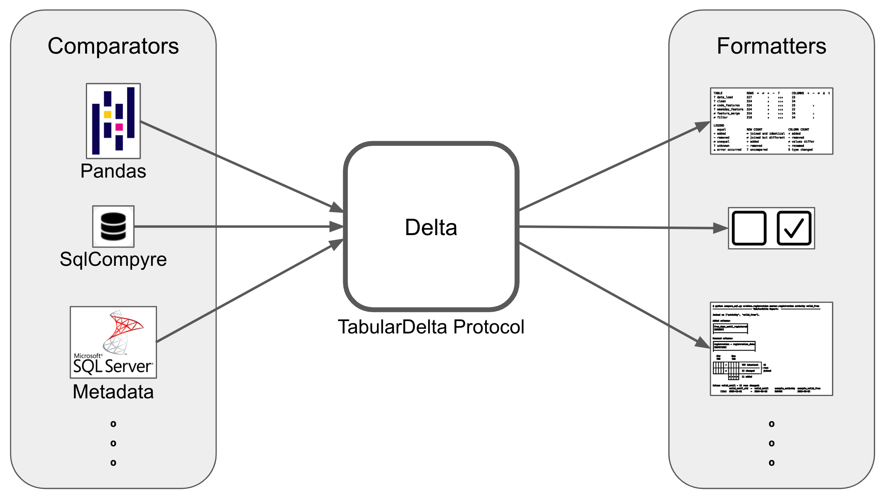

.. role:: red

.. role:: blue

.. role:: green

TabularDelta
=========================================

.. contents:: Contents
    :depth: 2

TabularDelta simplifies the comparison of diverse tables, like SQL tables or Pandas DataFrames.
It can both find small deviations in largely similar tables, as well as provide an overview of more structural changes.

To compare two tables, first select a comparator that supports the table format.
Now select any formatter that best suits your use case to obtain a visualization of the result.

Comparators return objects that comply with the TabularDelta protocol.
Formatters can render all objects that adhere to the TabularDelta protocol.
This approach allows you to freely combine comparators and formatters.
In addition, you can add support for new table types and output formats with minimal effort.

case.

Installation
============

.. code:: bash

    pip install sqlcompyre
    # or
    micromamba install sqlcompyre
    # or
    conda install sqlcompyre

Examples
========

Let's look at some increasingly complex code examples.

TabularDelta is particularly good for comparing large, confusing tables that are too big for this page.
So feel free to try it out on your own data!

.. code-block:: python

    df_old, df_new = ...
    delta = PandasComparator().compare(df_old, df_new)
    print(DetailedTextFormatter().format(delta))

Given two pandas DataFrames, we can compare them using the PandasComparator.
This returns (like every other comparator) an object which adheres to the TabularDelta protocol.
Thus, we can choose any formatter, like the DetailedTextFormatter, to visualize the result.

CSV Comparison Script
---------------------
Suppose you are an investor in a factory and have just received the new weekly work schedule.
Not only is the new schedule sorted by initials (instead of weekdays), but it is also shorter.
Now you want to find out as quickly as possible:
Is this due to less demand? Will the factory be closed on specific days?
Or is the reduced number of shifts just compensated by longer working hours?

We can answer these questions using this standalone python script for comparing two CSV files on disk.
Reading the CSV files into Pandas DataFrames enables the use of the PandasComparator.
The resulting delta is visualized using the DetailedTextFormatter.

.. code-block:: python

    import pandas as pd
    from tabulardelta import PandasComparator, DetailedTextFormatter

    df_old = pd.read_csv("week24.csv", index_col=[0, 1])
    df_new = pd.read_csv("week25.csv", index_col=[0, 1])

    delta = PandasComparator().compare(df_old, df_new)
    print(DetailedTextFormatter().format(delta))

Since no `join_columns` are specified for the comparison, the DataFrame index will be used for matching rows.
Here, the index are the first two columns, "Day" and "Who".

.. list-table::
   :header-rows: 1

   * - week24.csv
     - week25.csv
     - Python script output
   * - ::

        Day,Who,Shift
        Mon, ZR, 8h
        Mon, WO, 7h
        Mon, FJ, 6h
        Mon, GT, 3h
        Tue, FJ, 2h
        Tue, AT, 6h
        Tue, LK, 7h
        Tue, GT, 6h
        Tue, ZR, 3h
        Wed, LK, 8h
        Wed, ZR, 2h
        Wed, JK, 4h
        Wed, WO, 5h
        Wed, DA, 5h
        Thu, LK, 4h
        Thu, JK, 7h
        Thu, ZR, 5h
        Thu, DA, 8h
        Fri, DA, 4h
        Fri, GT, 8h
        Fri, LK, 2h
        Fri, JK, 5h
        Fri, LN, 5h
        Sat, ZR, 4h
        Sat, CN, 5h
        Sat, LN, 2h
        Sat, AT, 6h
        Sat, LK, 7h
        Sun, LN, 3h
        Sun, FJ, 5h
        Sun, JK, 8h
        Sun, ZR, 8h

     - ::

        Day,Who,Shift
        Sat, CN, 6h
        Wed, DA, 5h
        Thu, DA, 8h
        Fri, DA, 4h
        Mon, FJ, 6h
        Tue, FJ, 5h
        Sun, FJ, 5h
        Mon, GT, 3h
        Tue, GT, 7h
        Fri, GT, 8h
        Wed, JK, 4h
        Thu, JK, 7h
        Sun, JK, 8h
        Fri, JK, 5h
        Tue, LK, 7h
        Wed, LK, 8h
        Thu, LK, 4h
        Fri, LK, 2h
        Sat, LK, 7h
        Fri, LN, 5h
        Sat, LN, 5h
        Sun, LN, 3h
        Mon, WO, 7h
        Wed, WO, 5h
        Mon, ZR, 8h
        Tue, ZR, 5h
        Wed, ZR, 2h
        Thu, ZR, 5h
        Sat, ZR, 6h
        Sun, ZR, 8h

     - ::

        --------------- TabularDelta Report:  ---------------

        INFO: Row Order Changed!

        Joined on index.

        All columns and types are identical.

           Old         New
            32          30
        ┏━┯━┯━┯━┓
        ┃-│-│-│-┃              2 removed
        ┠─┼─┼─┼─┨╌╌╌┏━┯━┯━┯━┓---------------╶╮
        ┃ │ │ │ ┃ = ┃ │ │ │ ┃  24 identical  │ 30
        ┠─┼─┼─┼─┨╌╌╌┠─┼─┼─┼─┨--------------- ├╴rows
        ┃ │ │ │ ┃ ≠ ┃ │ │ │ ┃  6 changed     │ joined
        ┗━┷━┷━┷━┛╌╌╌┗━┷━┷━┷━┛---------------╶╯

        Column Shift - 6 rows changed:
                    Shift  →  Shift  example_Day  example_Who
              (2x)   2h    →   5h    Tue           FJ
                     3h    →   5h    Tue           ZR
                     4h    →   6h    Sat           ZR
                     5h    →   6h    Sat           CN
                     6h    →   7h    Tue           GT

        REMOVED ROWS EXAMPLES:
        Day│Who│Shift
        Sat│ AT│ 6h
        Tue│ AT│ 6h

In detail, the report shows us the following:

* Columns and data types have remained the same, which is obvious for the 3 columns here, but would not be for 30 columns.
* Two rows (shifts) have been removed.
* All other shifts still exist (30 joined), but only 24 stayed the same.
* For the remaining 6 shifts, the working hours increased.

CLI for Comparing SQL Tables
----------------------------

A simple CLI implementation for comparing SQL tables in a terminal.

After specifying the click arguments and getting a SQLAlchemy engine, it's the same thing as always:
Use a comparator to generate an object which adheres to the TabularDelta protocol, and choose a formatter to render the result.

.. code-block:: python

    @click.command()
    @click.argument("old_table")
    @click.argument("new_table")
    @click.argument("join_columns", nargs=-1)
    def compare_sql(old_table: str, new_table: str, join_columns: list[str]):
        engine: sqlalchemy.Engine = ...

        delta = SqlCompyreComparator(engine, join_columns).compare(old_table, new_table)
        print(DetailedTextFormatter().format(delta))

An example execution looks like this:

.. code-block:: bash

    $ python compare_sql.py archive.registration master.registration activity valid_from
    ---------------------- TabularDelta Report: registration -> registration ----------------------

    Joined on ['activity', 'valid_from'].

    Added columns:
    ┏━━━━━━━━━━━━━━━━━━━━━━━━━━┓
    ┃free_days_until_registered┃
    ┃(BIGINT)                  ┃
    ┣━━━━━━━━━━━━━━━━━━━━━━━━━━┫

    Renamed columns:
    ┏━━━━━━━━━━━━━━━━━━━━━━━━━━━━━━━━┓
    ┃registration → registration_date┃
    ┃(DATETIME)                      ┃
    ┣━━━━━━━━━━━━━━━━━━━━━━━━━━━━━━━━┫

       Old         New
       769         780
    ┏━┯━┯━┯━┓╌╌╌┏━┯━┯━┯━┓----------------╶╮
    ┃ │ │ │ ┃ = ┃ │ │ │ ┃  757 identical  │ 769
    ┠─┼─┼─┼─┨╌╌╌┠─┼─┼─┼─┨---------------- ├╴rows
    ┃ │ │ │ ┃ ≠ ┃ │ │ │ ┃  12 changed     │ joined
    ┗━┷━┷━┷━┛╌╌╌┠─┼─┼─┼─┨----------------╶╯
                ┃+│+│+│+┃  11 added
                ┗━┷━┷━┷━┛

    Column valid_until - 12 rows changed:
                 valid_until          →  valid_until          example_valid_from   example_activity
          (12x)  9999-12-31 00:00:00  →  2024-06-28 00:00:00  2000-01-01 00:00:00  123

    ADDED ROWS EXAMPLES:
    activity│valid_from         │registration_date  │valid_until
    892     │2000-01-01 00:00:00│2024-07-18 00:00:00│9999-12-31 00:00:00
    893     │2000-01-01 00:00:00│2024-07-18 00:00:00│9999-12-31 00:00:00
    894     │2000-01-01 00:00:00│2024-07-18 00:00:00│9999-12-31 00:00:00

Posting reports like this in a PR greatly helps reviewers to understand the changes.

SQL Pipeline Validation in Pipedag
----------------------------------

Keeping track of changes in data pipelines is often not easy.
But TabularDelta can help.

Let's say we use pipedag (from pydiverse) to define our pipeline.
Pipedag provides an :code:`@input_stage_versions` decorator,
which allows you to access the current and previous tables as dictionaries (name -> table).

.. code-block:: python

    @input_stage_versions(input_type=sa.Table)
    def validate_stage(tbls: dict[str, sa.Table], other_tbls: dict[str, sa.Table]):
        comparator = SqlMetadataComparator(MsSqlContainer().get_cache().sqlalchemy_engine())
        formatter = OverviewRowFormatter(warnings=False)
        formatter.add_header()

        for common in set(tbls) & set(other_tbls):
            delta = comparator.compare(tbls[common], other_tbls[common])
            formatter.format(delta)

        for added in set(tbls) - set(other_tbls):
            delta = comparator.compare(tbls[added], tbls[added])
            formatter.add_row(f"+ {added}", delta.count_new_rows, len(delta.new_columns))

        formatter.add_legend()
        print(formatter.table())

To get an overview of several changes, we use the OverviewRowFormatter.
The functions :code:`.add_header()`, :code:`.format()`, :code:`.add_row()`, and :code:`.add_legend()` each add rows.
The :code:`.table()` call at the end is used to output the accumulated rows as a table.

If a new table is added to the pipeline (so it is not yet in other_tbls when it is first executed),
we compare the new table with itself, and use :code:`formatter.add_row()` to mark it as new.

We use the SqlMetadataComparator to not delay the execution of the pipeline.
This comparator compares tables with as much details as possible while just looking at the metadata in the database.
Since it doesn't touch the actual data, it is very fast, but the rows can't be checked for equality.

::

    TABLE              ROWS  =  ≠  +  -  ?       COLUMNS  +  -  ≠  Δ  t
    ≠ data_load        327         ₇     ₃₂₀     23
    ≠ clean            324         ₆     ₃₁₈     24
    ≠ code_features    324         ₆     ₃₁₈     23          ₁
    ≠ weekday_feature  324         ₆     ₃₁₈     22
    ≠ feature_merge    324         ₆     ₃₁₈     24          ₁
    ≠ filter           318         ₃     ₃₁₅     24          ₁

    LEGEND
      equal                           ROW COUNT               COLUMN COUNT
    + added                           = joined and identical  + added
    - removed                         ≠ joined but different  - removed
    ≠ unequal                         + added                 ≠ values differ
    ? unknown                         - removed               Δ renamed
    ⚠ error occurred                  ? uncompared            t type changed

A column is missing unexpectedly at the end of the pipeline.
Usually, it would be cumbersome to find the source of this problem,
but using the report, we can immediately see that the bug was introduced in code_featuers.

Looking at the total row count, usually 3% of our rows are filtered out at the end.
But this time, over 57% of the new rows are missing, so it might be worth investigating further.

Extending TabularDelta
======================

TabularDelta Protocol
---------------------

The TabularDelta Protocol defines which information is available for a table comparison, and how to access this.
As a protocol, it is designed to be as generic as possible.
This would allow for a wide range of implementations, with extensions, lazy comparisons and more.

The protocol contains information about the comparison itself
(like the names of the tables, warnings, errors and additional information),
as well as the actual differences of the tables, which are separated in `cols` (for columns) and `rows`.

For more details, please have a look at the API reference:

.. toctree::
   :maxdepth: 1
   :caption: TabularDelta API:

   TabularDelta Protocol <api/tabulardelta.tabulardelta>

Comparators using TabularDelta_Dataclasses
----------------------------------------------

Comparators can compare two (tabular) data sources and return an object which adheres to the TabularDelta protocol:

.. code-block:: python

    T = TypeVar("T", contravariant=True)

    class Comparator(Protocol[T]):
        def compare(self, old: T, new: T) -> TabularDelta: ...

All current comparators rely on
:doc:`tabulardelta_dataclasses.py<api/tabulardelta.comparators.tabulardelta_dataclasses>`
which implements the TabularDelta protocol using dataclasses.

These currently implemented Comparators are:

**SqlCompyreComparator**: This comparator is a wrapper which uses SQLCompyre to create a comparison result.

**SqlMetadataComparator**: Repeatedly comparing a large number of huge tables using SQLCompyre leads to delays.
The SqlMetadataComparator uses DBS-specific metadata to achieve the best possible comparison in O(1) with regards to the number of rows.
At the moment this is only implemented for MsSql Server, but can easily be extended for other DBSs with just a few lines of code.

**PandasComparator**: This comparator compares two DataFrames.
Since many tabular formats support the conversion to Pandas DataFrames, and Pandas itself offers a variety
of import options, this can also be used for CSV, Polars, Excel, JSON, Parquet, etc.

To write a new Comparator, you just need to implement the `compare` method,
which returns an object adhering to the TabularDelta protocol.

.. code-block:: python

    @dataclass
    class PolarsComparator:
        join_columns: list[str] | None = None
        name: str = ""

        def compare(self, left: pl.DataFrame, right: pl.DataFrame) -> TabularDelta:
            comparator = PandasComparator(self.join_columns, self.name)
            return comparator.compare(left.to_pandas(), right.to_pandas())

Of course, it would be more efficient and less error-prone for special cases, if you could directly compare Polars DataFrames,
so feel free to implement a "real" PolarsComparator and to open a PR for it :)

For more details, please have a look at the API reference:

.. toctree::
   :maxdepth: 1
   :caption: Comparators:

   Comparator Protocol <api/tabulardelta.comparators.comparator>
   PandasComparator <api/tabulardelta.comparators.pandas_comparator>
   SqlCompyreComparator <api/tabulardelta.comparators.sqlcompyre_comparator>
   SqlMetadataComparator <api/tabulardelta.comparators.sqlmetadata_comparator>
   TabularDelta Dataclasses <api/tabulardelta.comparators.tabulardelta_dataclasses>

Formatters and TabularText
--------------------------------

Formatters take an object which adheres to the TabularText protocol and do something with it.

.. code-block:: python

    T = TypeVar("T", covariant=True)

    class Formatter(Protocol[T]):
        def format(self, delta: TabularDelta) -> T: ...

Most formatters just visualize the differences in a human-readable way.
Therefore, many use the TabularText module might be useful, which enables rendering tables with different borders, rowspans and colspans:

.. code-block:: python

    from tabulardelta.formatters.tabulartext.cell import Cell
    from tabulardelta.formatters.tabulartext.table import Table, Border

    row1 = ["Just", "first", "row", Cell(["Two", "Rows"], rowspan=2)]
    row2 = [Cell(["Second\nRow"], colspan=3), "BottomRight"]

    print("\nDefault border:")
    print(Table.from_lists([row1, row2]).to_string())

    print("\nDIY border:")
    inner_border = Border(",,,,  | ,,  + ,  + ,, ---,,  + ,  + ,,  + ,,,,")
    print(Table.from_lists([row1, row2], inner_border).to_string())

This will output the following tables:

.. code-block::

    Default border:
    ┏━━━━┯━━━━━┯━━━┯━━━━┯━━━━━━━━━━━┓
    ┃Just│first│row│Two │           ┃
    ┠────┴─────┴───┤Rows├───────────┨
    ┃Second        │    │BottomRight┃
    ┃Row           │    │           ┃
    ┗━━━━━━━━━━━━━━┷━━━━┷━━━━━━━━━━━┛

    DIY border:
    Just | first | row | Two  |
    ---- + ----- + --- + Rows + -----------
    Second             |      | BottomRight
    Row                |      |

The currently available formatters, which both use TabularText, are:

**DetailedTextFormatter**: The goal of this formatter is to get as many details about a single comparison without loosing the overview.

**OverviewRowFormatter**: This formatter is stateful, and collects comparisons as rows.
Calling `table()` will combine all comparisons into a single table.
Additionally, `add_header`, `add_row`, and `add_legend` allows to extend the visualisation with additional information.

To show how easy it is to write a new formatter, let's say we want to use TabularDelta within test cases.
The following implementation of a new formatter works as follow: Given a TabularDelta object,
all changes are collected in a list, and an AssertionError is raised if this list isn't empty.

.. code-block:: python

    class AssertingFormatter:
        @staticmethod
        def format(delta: TabularDelta) -> None:
            type_chgs = chain.from_iterable(
                (delta.cols.comparable_type_changed, delta.cols.incomparable_type_changed)
            )
            changes = [
                [f"Removed {c.name}" for c in delta.cols.removed],
                [f"Added {c.name}" for c in delta.cols.added],
                [f"Renamed {c.old.name} -> {c.new.name}" for c in delta.cols.renamed],
                [f"{c.new.name} changed: {c.old.type} -> {c.new.type}" for c in type_chgs],
                ["New rows"] * (len(delta.rows.added) > 0),
                ["Missing rows"] * (len(delta.rows.removed) > 0),
                ["Changed rows"] * (len(delta.rows.unequal) > 0),
            ]
            if flat_changes := list(chain.from_iterable(changes)):
                raise AssertionError("\n - ".join(flat_changes))

    def test_example():
        expected = pd.DataFrame({"id": [1, 2, 3]})
        observed = ...

        delta = PandasComparator().compare(expected, observed)
        AssertingFormatter.format(delta)

With only a few lines of code, we can now use all Comparators together with the newly written
AssertingFormatter, to check various table formats for equality.

.. parsed-literal::

    :red:`>           raise AssertionError("\n - ".join(flat_changes))
    E           AssertionError:
    E            - Added data
    E            - Renamed id -> key
    E            - New rows`

    :blue:`asserting_formatter.py:31`: :red:`AssertionError`

The output will explain, which changes led to the failure. If more details are needed,
you could easily extend the formatter, or just print the result of the DetailedTextFormatter.

For more details, please have a look at the API reference:

.. toctree::
   :maxdepth: 1
   :caption: Formatters:

   Formatter Protocol <api/tabulardelta.formatters.formatter>
   DetailedTextFormatter <api/tabulardelta.formatters.detailed_text_formatter>
   OverviewRowFormatter <api/tabulardelta.formatters.overview_row_formatter>
   Table Rendering <api/tabulardelta.formatters.tabulartext>

Indices and tables
==================

* :ref:`genindex`
* :ref:`modindex`
* :ref:`search`
